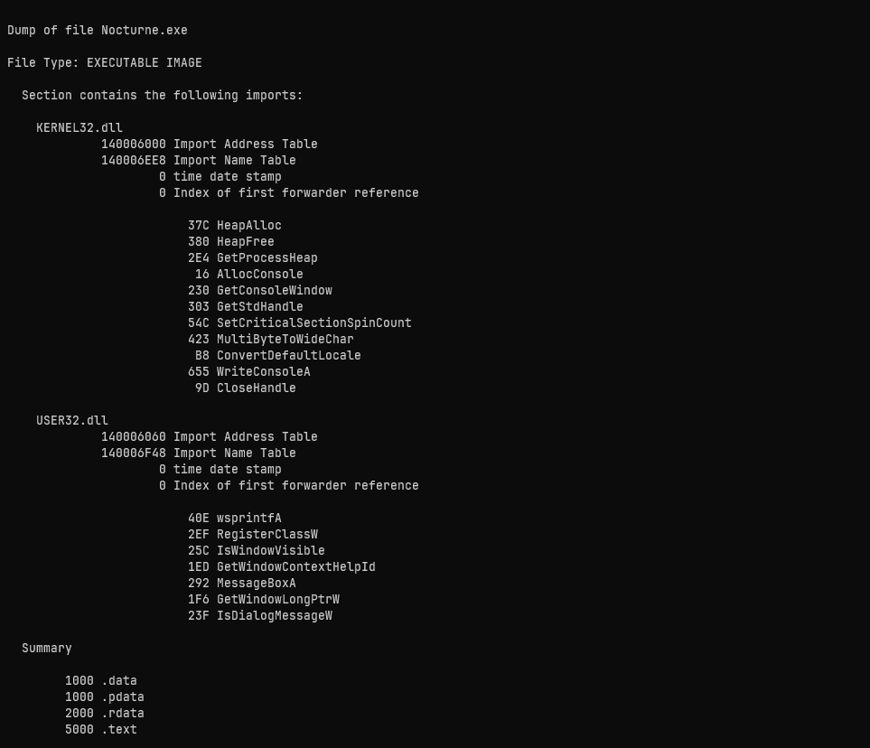
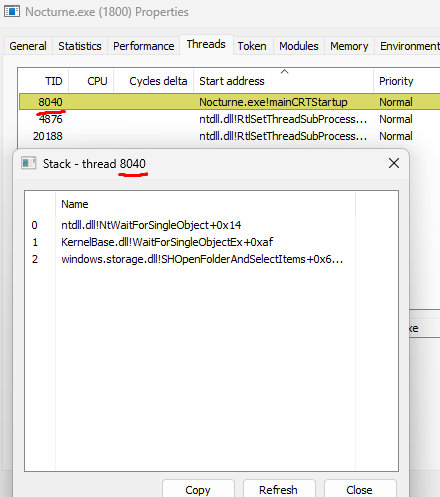
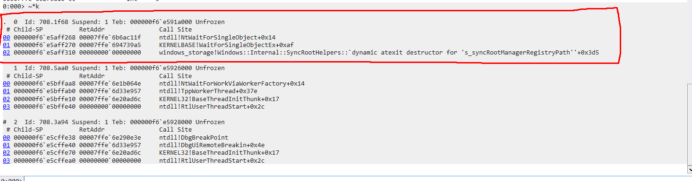
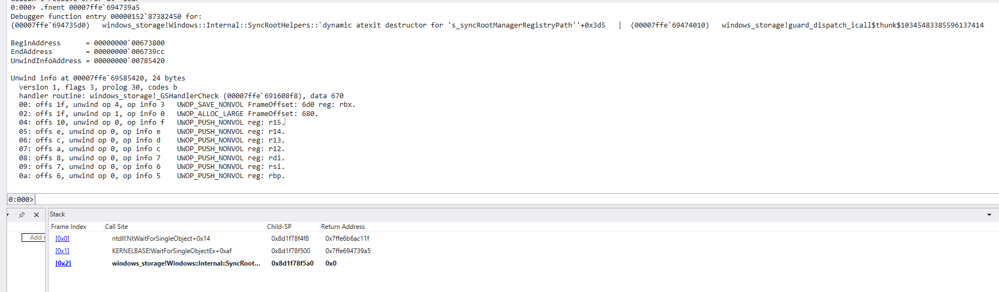
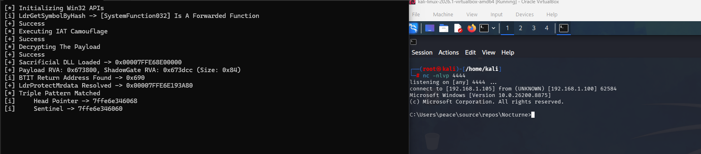

<div align="center">

# 🌙 Nocturne

### CET-Compatible Stack Spoofing Loader

A Windows x64 loader that achieves **legitimate call stacks** through runtime function table manipulation, code cave injection, and inverted function table collapse — fully compatible with Intel CET Shadow Stacks.

[](https://microsoft.com)
[](https://isocpp.org)
[](https://learn.microsoft.com/en-us/cpp/assembler/masm/masm-for-x64-ml64-exe)
[](LICENSE)

</div>

---

## Overview

Nocturne is a research-oriented Windows x64 shellcode loader built around a single goal: producing **clean, fully backed call stacks** that are indistinguishable from legitimate Windows threads — even under manual forensic inspection with WinDbg.

Modern EDR solutions and manual analysts rely on call stack integrity as a primary detection signal. Unbacked return addresses, misaligned frames, and dynamic function table artifacts are all strong indicators of malicious activity. Traditional stack spoofing techniques address some of these, but they break under **Intel CET (Control-flow Enforcement Technology)** shadow stack validation, where the hardware maintains a separate, read-only copy of return addresses that must match the software stack.

Nocturne solves this by taking a fundamentally different approach: instead of fabricating fake frames, it **injects code into a legitimate module's `.text` section** and registers a `RUNTIME_FUNCTION` entry with **real donor unwind metadata** from that module. The Windows unwinder then walks the stack using genuine unwind info, producing frames that point back to a signed, backed DLL (`windows.storage.dll`). Because the code physically resides within the module's address range and the unwind chain is structurally valid, both software-based stack walks and CET hardware validation see a legitimate call chain.

The loader is built entirely **CRT-free** (`/NODEFAULTLIB`) with a custom entry point, custom `memset`/`memcpy` intrinsics, and `HeapAlloc`/`HeapFree` operator overrides — no C runtime dependency in the final binary. All Win32 and NT API resolution happens at runtime through **compile-time DJB2 hashing** (`constexpr`): the hash values are computed during compilation and embedded as immediate constants, while the actual function pointers are resolved at runtime by walking PEB loader data structures. This means zero API name strings exist in the binary, and the IAT contains only benign camouflage imports.

> [!IMPORTANT]
> The payload exits immediately after execution, so short-lived shellcode (e.g. `calc.exe` launcher) will terminate before you can inspect the call stack. To properly analyze the spoofed stack, use a **persistent payload** such as an `msfvenom` reverse shell or a long-lived beacon — anything that keeps the thread alive long enough for manual inspection with WinDbg or Process Hacker.

---

## Techniques & Why They Were Chosen

### 🔧 API Hash Resolution (DJB2)

All Win32/NT APIs are resolved at runtime by walking the PEB loader data structures and matching export names against precomputed DJB2 hashes. The hashes are generated at **compile time** using `constexpr` evaluation — the compiler computes each hash and embeds it as an immediate constant in the binary. At runtime, the resolver iterates the target module's export table and compares each export name's hash against the embedded constant. This eliminates IAT entries that would otherwise reveal the loader's true capabilities to static analysis tools, and ensures no API name strings are present in the binary.

### 🎭 IAT Camouflage

The Import Address Table is populated exclusively with **benign USER32.dll imports** (`MessageBoxA`, `RegisterClassW`, `IsWindowVisible`, etc.) placed inside an unreachable code branch. Static analysis tools see a harmless GUI application rather than a loader.

<div align="center">

<br/>
<em>Clean IAT — only benign USER32.dll imports and heap management functions</em>
</div>

### 🛡️ CET-Compatible Stack Spoofing (RTFI + JIT)

This is Nocturne's core technique. The stack spoofing pipeline:

1. **Sacrificial DLL Loading** — `windows.storage.dll` is loaded as the donor module
2. **Code Cave Injection** — Payload + ShadowGate stub are injected into `.text` section slack space
3. **Dynamic Function Table Registration** — `RtlAddFunctionTable` registers a `RUNTIME_FUNCTION` entry pointing to **donor unwind info**, making the injected code appear as a legitimate function within the module
4. **Inverted Function Table Collapse** — The internal `RtlpInvertedFunctionTable` entry for the donor module is collapsed so the dynamic table takes priority during unwinding
5. **Cache Invalidation** — Both the function table cache and function entry cache are flushed to force the unwinder through the manipulated lookup path
6. **Type=0 WinDbg Bypass** — The dynamic function table entry type is patched from `RF_CALLBACK` to `RF_SORTED`, preventing WinDbg from resolving it as dynamic
7. **`.pdata` Suppression** — The donor module's `.pdata` section protection is set to `PAGE_NOACCESS`, forcing all unwind lookups through the controlled dynamic table

The result: every frame in the call stack resolves to `windows_storage!<function>` — a legitimate, backed module.

<div align="center">

<br/>
<em>Process Hacker call stack — all frames resolve to windows.storage.dll</em>
</div>

<br/>

<div align="center">

<br/>
<em>WinDbg stack trace showing legitimate windows_storage frames</em>
</div>

### 🔍 WinDbg Bypass Verification

The dynamic function table entry is invisible to WinDbg's forensic commands. Type patching and `.pdata` suppression ensure that debugger analysis cannot distinguish the spoofed frames from real ones.

<div align="center">

<br/>
<em>WinDbg bypass — .fnent shows donor unwind info, no dynamic table artifacts</em>
</div>

### 🔒 CRT-Free Build

The entire project compiles with `/NODEFAULTLIB` and a custom entry point. Memory management uses `HeapAlloc`/`HeapFree` through operator overrides. `memset` and `memcpy` are implemented as custom intrinsics. This eliminates CRT dependencies that would inflate the binary and add unnecessary attack surface.

### 🐚 Payload Execution

Shellcode is XOR-decrypted at runtime and executed through the **ShadowGate** assembly stub, which sets up the spoofed stack frame before transferring control.

<div align="center">

<br/>
<em>Reverse shell established with fully spoofed call stack</em>
</div>

---

## Build

Open `Nocturne.sln` in Visual Studio and build for **x64 Release** or **x64 Debug**.

| Configuration | Description |
|---|---|
| **Debug x64** | Console output enabled, `DEBUG` preprocessor defined |
| **Release x64** | Silent execution, no debug output |

> Both configurations use `/NODEFAULTLIB`, static CRT (`/MT`), no buffer security checks, and no C++ exceptions.

> [!NOTE]
> For production use, make sure the `DEBUG` preprocessor definition is **removed** from your build configuration. The Debug x64 preset defines it by default — switch to Release x64 or manually remove `_DEBUG` and `DEBUG` from **Project Properties → C/C++ → Preprocessor Definitions** to disable all console output.

---

## Project Structure

```
Nocturne/
├── include/
│   ├── Common.h              # Global API struct & function declarations
│   ├── IatCamouflage.h       # IAT camouflage with benign imports
│   ├── InitializeAPI.h       # Runtime API resolution
│   ├── Primitives.h          # Hash functions & utility macros
│   ├── Structs.h             # NT structures & custom types
│   └── Debug.h               # Debug console & print macros
├── src/
│   ├── Main.cpp              # Entry point & orchestration
│   ├── StackSpoofing.cpp     # Stack spoofing pipeline
│   ├── Unwind.cpp            # Unwind info parsing & manipulation
│   ├── Context.cpp           # Spoof context tracking & rollback
│   ├── Resolver.cpp          # PEB walking & hash-based API resolution
│   ├── StackUtils.cpp        # Stack origin & cookie detection
│   ├── Proxy.cpp             # Thread pool proxied API calls
│   ├── Intrinsic.cpp         # Custom memset/memcpy
│   ├── Debug.cpp             # Debug console allocation
│   ├── ShadowGate.asm        # Payload execution stub
│   ├── StackSearch.asm       # Stack scanning primitives
│   ├── SetRegister.asm       # Register manipulation
│   └── ApiStub.asm           # Indirect syscall stubs
└── docs/
    └── screenshots/
```

---

## References

- [klezVirus](https://github.com/klezVirus) — Original author of the BYOUD technique that Nocturne's stack spoofing is built upon
- [klezVirus/BYOUD](https://github.com/klezVirus/BYOUD) — Bring Your Own Unwind Data — the foundational research behind runtime function table manipulation
- [BYOUD Blog Post](https://klezvirus.github.io/posts/Byoud/) — Detailed technical writeup of the BYOUD technique
- [MalDev Academy](https://maldevacademy.com/) — Malware development techniques and methodology
- [Microsoft x64 Exception Handling](https://learn.microsoft.com/en-us/cpp/build/exception-handling-x64?view=msvc-170) — Official documentation on x64 unwind info, `RUNTIME_FUNCTION`, and the exception handling ABI
- [Stack Spoofing — Black Hat Talk](https://www.youtube.com/watch?v=tOVcScKuJvU&t=847s) — Presentation on advanced stack spoofing techniques
- [Hiding in Plain Sight](https://0xdarkvortex.dev/hiding-in-plainsight/) — Thread stack spoofing and call stack manipulation research

---

## Disclaimer

This project is intended for **authorized security research and educational purposes only**. The author is not responsible for any misuse. Always obtain proper authorization before testing on systems you do not own.

---

<div align="center">

If you find this project useful or interesting, consider leaving a ⭐

Your support motivates further research and development.

</div>
